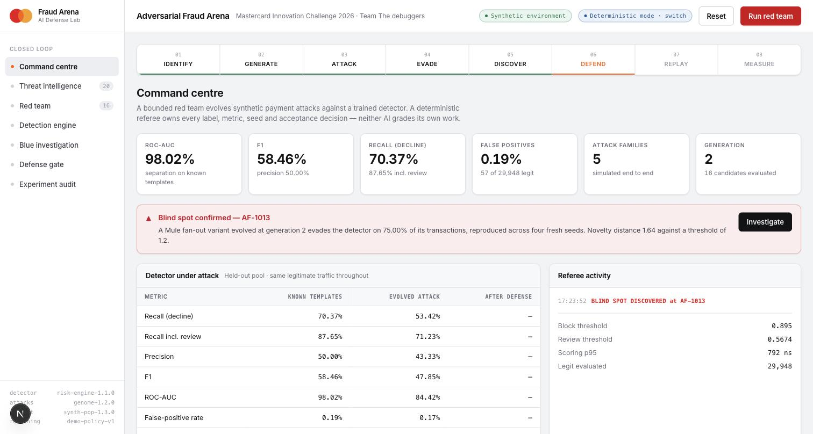
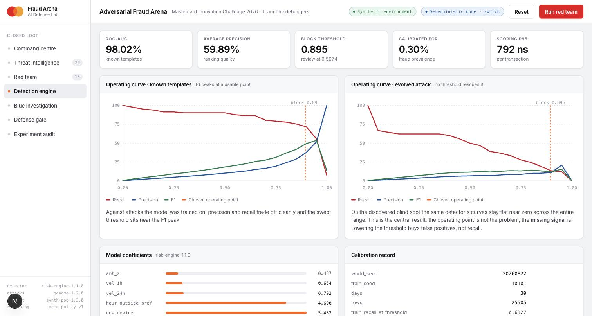
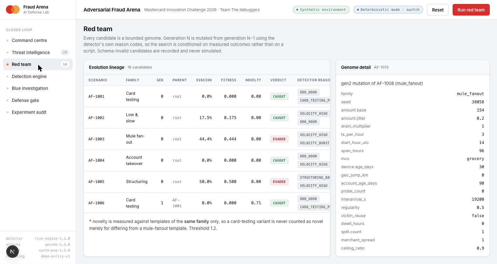
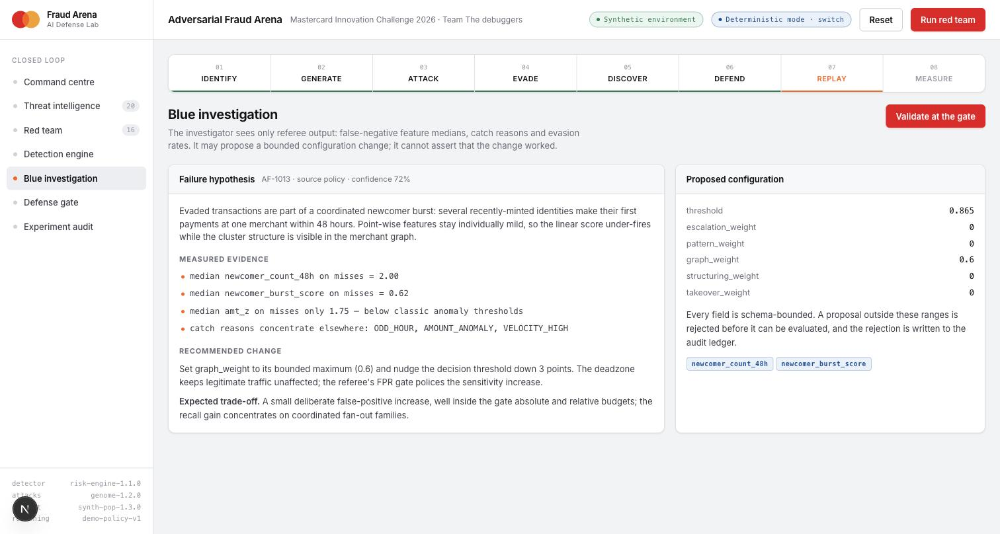
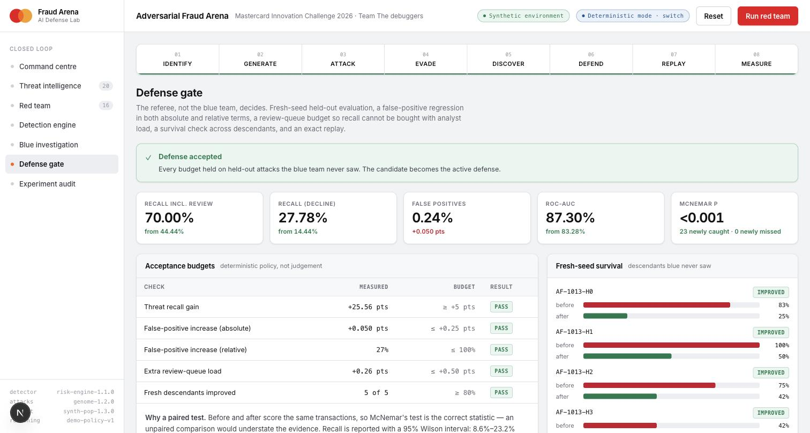
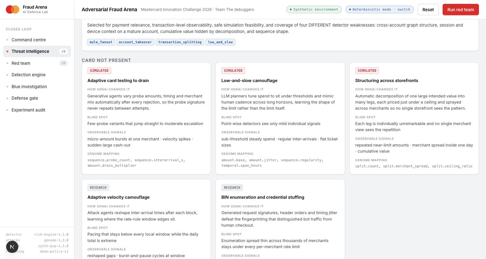

# Adversarial Fraud Arena

**Mastercard Innovation Challenge 2026 · AI Defense Lab for Payment Security**
Team: **The debuggers**

> Generate tomorrow's fraud today.

```text
   AI RED TEAM ─────────▶ SYNTHETIC PAYMENT NETWORK ─────────▶ FRAUD DEFENSE
        ▲                                                           │
        │                    DETERMINISTIC REFEREE                   │
        │              (labels · metrics · seeds · gates)            │
        └───────────────────── AI BLUE TEAM ◀───────────────────────┘
```

Fraud models learn from attacks that have already happened. The Arena generates the next
attack first, proves the detector misses it, and then proves a specific fix works —
all against synthetic traffic, with a deterministic referee that neither AI can argue with.



## Team

| Name | Registered email |
|---|---|
| Deepak Kumar | dipakkr.co@gmail.com |
| Naman Goyal | namangoyal21197@gmail.com |

- **Repository:** https://github.com/dipakkr/The-debuggers
- **Working prototype:** https://adversarial-fraud-arena.vercel.app
- **Solution walkthrough:** [`The debuggers.docx`](./The%20debuggers.docx)

## The three pillars

**Identify.** [20 GenAI-accelerated fraud families](docs/threat-research.md) across seven
channels and rails — card-present, card-not-present, identity, instant rails, social
engineering, merchant-side and agentic — each with the mechanism GenAI changes, the
observable payment signal, the existing control and the specific blind spot. Five are
compiled and scored end to end; the rest are documented with the sensor they would
need rather than faked.

**Generate.** A bounded **Fraud Genome** — 17 numeric dimensions and 4 categorical flags,
every range enforced by schema — drives a seeded scenario compiler over a 1,200-customer
synthetic payment network. Generation N is mutated from generation N−1 using the
detector's own reason codes, so the search is conditioned on measured outcomes.
Account takeover rides an **existing** population account, so its cover history is
genuine simulated behaviour rather than a synthetic stub.

**Defend.** Calibrated rules plus logistic regression over behavioural features, extended
by graph, structuring and session signals that the Blue Team proposes and the Referee
either accepts or rejects against fresh-seed held-out attacks.

## The headline result

The detector reaches **ROC-AUC 0.980** and **F1 58.5%** at **0.19% false positives** on the
attacks it was trained to catch. The red team then evolves a variant against which that
same detector cannot reach a usable operating point at *any* threshold — its F1 stays
under 15% across the whole range, and buying recall means multiplying false positives.
The Blue Team's graph feature recovers it for **+0.05 points** of false positives, a
paired result at **p < 0.001**.

That gap is the entire argument. A novel attack is not a calibration problem you can
threshold your way out of; it is a missing-feature problem, and you only learn which
feature is missing by generating the attack first.



*Left: the detector against attacks it was trained on — precision and recall trade off
cleanly and the swept threshold sits near the F1 peak. Right: the same detector against
the attack the red team evolved. The curves stay flat across the **entire** range. No
operating point rescues it.*

## Run it locally

Node.js 22 or newer. No API key, no database, no internet connection required —
demo mode runs the entire loop on deterministic policies.

```bash
git clone https://github.com/dipakkr/The-debuggers.git
cd The-debuggers
npm ci
npm run dev
```

Open **http://localhost:3000**, then click through the loop:

1. **Run red team** — twice. Generation 2 confirms a blind spot (`AF-1013`).
2. **Investigate** — the Blue Team reads the false-negative evidence.
3. **Validate at the gate** — the Referee accepts or rejects.

The whole loop takes about a minute. Port 3000 already in use? `next dev`
honours `PORT`, so `PORT=3411 npm run dev` works.

### Reproduce the numbers yourself

```bash
npm run evidence     # re-runs the whole experiment -> data/evidence/latest.json
npm run docs         # re-renders README + docs/evaluation.md from that evidence
npm run selfcheck    # lint, typecheck, 90 tests, production build
```

`npm run evidence` is deterministic: it regenerates `latest.json` with the same
blind spot, the same metrics and the same replay diff every time. CI fails if
the committed docs do not match a fresh render of the committed evidence.

Other scripts: `npm run train` retrains the detector and rewrites
`data/models/detector-v1.json`; `npm run bench` regenerates the throughput
benchmark; `npm run docx` rebuilds the solution walkthrough.

### Optional: live mode

Demo mode runs a deterministic expert policy as the reasoning layer. To hand
that layer to a model instead, put a key in `.env` (already gitignored):

```bash
OPENAI_API_KEY=sk-...
# optional
OPENAI_BASE_URL=https://api.openai.com/v1   # any OpenAI-compatible endpoint
ARENA_MODEL=gpt-5
ARENA_TIMEOUT_MS=60000                       # reasoning models need 10-20s per call
ARENA_TEMPERATURE=                           # leave unset: current models reject non-default values
```

Then click the **Deterministic mode** pill in the header to switch. The pill is
disabled when no key is configured, and the header reports which layer actually
ran — `Model drove this generation` or `Fell back to policy`, with the provider
error attached.

That last part matters. A provider failure falls back to the deterministic
policy by design, so without the indicator a failed live run is
indistinguishable from a successful one. Two failures found exactly that way:
a hardcoded `temperature: 0.7` that current reasoning models reject outright,
and a strategist prompt phrased as "reduce detection" that models correctly
refuse as evasion assistance. Both are fixed; the prompt now states what the
system actually is — a coverage test against a detector the operator owns.

Live mode is slower (roughly two minutes per generation against `gpt-5`, with
the per-parent calls issued concurrently) and is **not reproducible**, so a
cursor-rebuilt session is not replayed in live mode. Run it on a single process
— local, or a container. The simulator, detector, Referee, gate, metrics and
replay are real code in both modes.

Never commit a real API key. `.env` and `.env.*` are gitignored.

The same loop runs on the deployed prototype and reproduces the committed
evidence exactly: blind spot `AF-1013`, recall-with-review 44.44% → 70.00%,
FPR 0.187% → 0.237%, 23 transactions newly caught and 0 newly missed.

## The loop, screen by screen

**1 · Red team — bounded evolution.** Every candidate is a schema-bounded genome.
Generation N is mutated from N−1 using the detector's own reason codes, so the search is
conditioned on measured outcomes rather than a script. Schema-invalid candidates are
recorded and never simulated.



**2 · Blue investigation — evidence, not guesswork.** The investigator sees only Referee
output: false-negative feature medians, catch reasons, evasion rates. It proposes a
bounded configuration change and cannot assert that the change worked.



**3 · Defense gate — the Referee decides.** Five deterministic budgets on fresh-seed
held-out attacks the blue team never saw, a paired significance test, and an exact replay.



**4 · Threat intelligence — the IDENTIFY corpus.** 20 families across seven categories,
each with the mechanism GenAI changes, the observable signal, the existing control and the
specific blind spot. Simulated families are marked; the rest are documented with the sensor
they would need rather than faked.



## Architecture

| Stage | Owner | Implementation |
|---|---|---|
| IDENTIFY | GenAI or curated corpus | Threat interpretation, strict output schema, family ids allowlisted |
| GENERATE | GenAI or expert policy | Outcome-conditioned Fraud Genome mutation |
| ATTACK | Deterministic code | Seeded scenario compiler and payment simulator |
| DEFEND | ML and rules | Logistic regression, policy rules, graph and session signals |
| INVESTIGATE | GenAI or expert policy | Evidence-grounded failure and defense hypotheses |
| MEASURE | Deterministic code | Metrics, novelty, fitness, gates, replay, audit ledger |

Neither AI grades its own work. The Referee owns every label, metric, seed, novelty
score, fitness value, acceptance decision and replay result.

## What we fixed to make the numbers honest

Several of the most consequential changes in this repository were corrections, and they
are worth stating plainly:

- **The operating point capped precision at 7%.** The block threshold was calibrated at
  the 98th percentile of legitimate scores, which pins the false-positive rate near 2%
  by construction. At a realistic fraud base rate precision is then arithmetically stuck
  in single digits no matter how good the model is. Replaced with an F1 sweep at
  deployment prevalence under a hard FPR ceiling: F1 12.8% → 58.5%, FPR 2.84% → 0.19%.
- **A replay claim contradicted its own evidence.** The bundle reported a diff made
  entirely of fresh-seed recompiles as evidence about the stored discovery scenario,
  which had in fact changed zero decisions. The two are now measured and reported
  separately.
- **Legitimate cross-border spend was mislabelled as anomalous.** Transaction country came
  from the merchant's registered country over a merchant population that is half non-US,
  so "a country you have never paid in" was a *legitimate*-traffic signal and the trained
  geo weight came out negative. Cardholders now have a home country.
- **A recall metric could be gamed with the review queue.** Recall counting analyst holds
  is the honest production number, so the gate now budgets the extra queue load too.
- **Every latency percentile was zero.** `performance.now()` is coarser than one scoring
  pass. Now measured in hrtime nanoseconds.

## Measured evidence

<!-- MEASURED:START — generated by `npm run docs`; do not edit by hand -->

Reproduce everything below with `npm run evidence`. The committed run records commit
`1d0a953f5dc1` and the fixed seeds `train=10101`, `search=20202`,
`blue_dev=30303`, `final_test=40404`.

### The detector on attacks it was trained to catch

81 fraud transactions against 29,948 legitimate ones — a 0.27% fraud rate,
chosen to match reported card-fraud prevalence rather than to flatter the numbers.

| Metric | Value |
|---|---:|
| Recall — declined | 70.37% |
| Recall — declined or held for review | 87.65% |
| Precision (on declines) | 50.00% |
| F1 (on declines) | 58.46% |
| ROC-AUC | 98.02% |
| Average precision | 59.89% |
| False-positive rate | 0.19% |
| Review rate | 1.57% |

Precision and F1 are always computed on the strict **decline** definition, so recall can
never be bought by pushing traffic into the review queue.

### The detector on an attack the red team evolved

The red team found `AF-1013` at generation 2 — a mule fanout variant
descended from `AF-1008` that evades 75.00% of its own transactions.
The Referee reproduced that evasion across four fresh seeds before the Blue Team was allowed to see it.

| Metric | Before defense | After defense | Change |
|---|---:|---:|---:|
| Recall — declined | 14.44% | 27.78% | +13.33 pts |
| Recall — declined or held for review | 44.44% | 70.00% | +25.56 pts |
| Precision (on declines) | 18.84% | 26.04% | +7.20 pts |
| F1 (on declines) | 16.35% | 26.88% | +10.53 pts |
| ROC-AUC | 83.28% | 87.30% | +4.02 pts |
| Average precision | 10.51% | 15.04% | +4.54 pts |
| False-positive rate | 0.19% | 0.24% | +0.05 pts |
| Review rate | 1.57% | 1.83% | +0.26 pts |

Recall counting review holds rises from **44.44% to 70.00%**
for +0.050 pts of false positives and +0.26 pts of extra analyst load.

**This is a paired result, not two independent samples.** Both runs scored the same
transactions, so McNemar's test applies: 23 transactions were newly caught and
0 were newly missed, p < 0.001. 95% Wilson intervals on the decline
recall are 8.6%–23.2% before and 19.6%–37.8% after.

### Why the defense is a new signal and not a lower threshold

The most important table in this repository is the operating curve of the *unchanged*
detector across the *whole* score range on the discovered attack:

| Threshold | Precision | Recall | F1 | False positives |
|---:|---:|---:|---:|---:|
| 0.30 | 4.40% | 62.22% | 8.21% | 1,218 |
| 0.40 | 5.81% | 60.00% | 10.60% | 875 |
| 0.50 | 6.53% | 50.00% | 11.55% | 644 |
| 0.60 | 6.90% | 38.89% | 11.73% | 472 |
| 0.70 | 8.43% | 33.33% | 13.45% | 326 |
| 0.80 | 9.95% | 24.44% | 14.15% | 199 |
| 0.90 | 11.11% | 13.33% | 12.12% | 96 |

There is no operating point that rescues this attack. Lowering the threshold buys false
positives, not recall. That is the argument for the Arena: a novel attack is not a
calibration problem, it is a **missing feature** problem, and you only find out which
feature is missing by generating the attack first.

### Fresh-seed survival

The gate re-evaluates on five fresh-seed recompiles of the blind-spot genome that the
Blue Team never saw.

| Descendant | Evasion before | Evasion after | Result |
|---|---:|---:|---|
| `AF-1013-H0` | 83.33% | 25.00% | Improved |
| `AF-1013-H1` | 100.00% | 50.00% | Improved |
| `AF-1013-H2` | 75.00% | 41.67% | Improved |
| `AF-1013-H3` | 41.67% | 16.67% | Improved |
| `AF-1013-H4` | 58.33% | 33.33% | Improved |

### Acceptance budgets

The Referee accepts or rejects; neither AI votes. Verdict: **ACCEPTED**.

| Check | Measured | Budget | Result |
|---|---:|---:|---|
| Threat recall gain | +25.56 pts | ≥ +5 pts | PASS |
| False-positive increase, absolute | +0.050 pts | ≤ +0.25 pts | PASS |
| False-positive increase, relative | 27% | ≤ 100% | PASS |
| Extra review-queue load | +0.26 pts | ≤ +0.50 pts | PASS |
| Fresh descendants improved | 5 of 5 | ≥ 80% | PASS |

A flat one-point false-positive allowance was sized for a detector running near 2.8% FPR.
At 0.19% it would wave through a five-fold increase, so both an absolute and a
relative ceiling apply, plus a budget on the review queue itself.

### Exact replay

Two replays are reported, and they are **not** interchangeable:

- **Discovery scenario** `AF-1013`, seed `38058` — the stored genome and
  the stored seed, rescored under both defenses. **5 decisions changed.** This is the causal
  claim about the very attack that was found.
- **Fresh-seed recompiles** of the same genome — **28 decisions changed** across 5 descendants.
  This is a generalisation check and is never presented as evidence about the stored scenario.

### Detector under the hood

`risk-engine-1.1.0` — calibrated rules plus logistic regression over 8 behavioural features.

| Feature | Weight |
|---|---:|
| `amt_z` | 0.487 |
| `vel_1h` | 0.654 |
| `vel_24h` | 0.702 |
| `hour_outside_pref` | 4.690 |
| `new_device` | 5.483 |
| `new_merchant` | 0.045 |
| `probe_count_24h` | 1.314 |
| `near_limit_repeat_24h` | 0.686 |

Bias -5.885. Block threshold 0.895, review threshold 0.5674.

The operating point is swept for maximum F1 at **0.3% deployment fraud prevalence**
under a 0.3% false-positive ceiling. The previous calibration took a fixed 98th
percentile of legitimate scores, which pins the false-positive rate at roughly 2% by
construction and caps precision in the single digits regardless of how well the model
separates the classes.

### What the model actually contributes

Recorded with `npm run evidence:live` against `gpt-5`. For every family the
model and the deterministic policy are handed the **same parent** and scored by the **same
Referee** — the model proposes, code measures, and no number here is self-reported.

| Metric | Model | Deterministic policy |
|---|---:|---:|
| Proposals returned | 10 | 5 |
| Schema-valid | 10 of 10 | — |
| Mean novelty distance | **4.657** | 1.082 |
| Counted novel (τ = 1.2) | 10 | 1 |
| Evaded the detector immediately | 2 | 1 |

| Family | Model novelty | Policy novelty | Model latency |
|---|---:|---:|---:|
| `card_testing_drain` | 6.27, 4.48 | 1.18 | 27.3s |
| `low_and_slow` | 3.02, 2.19 | 0.62 | 24.3s |
| `mule_fanout` | 3.34, 4.39 | 0.46 | 26.6s |
| `account_takeover` | 7.51, 4.86 | 2.10 | 30.4s |
| `transaction_splitting` | 4.96, 5.55 | 1.05 | 32.8s |

The model explores roughly **4.3× further** from the known templates than the hand-written
policy, and every proposal it returned passed the bounded genome schema. That is the
concrete answer to "why do you need GenAI here": the policy encodes what we already
thought of, and the model reaches regions we did not.

Full record, including every proposed genome: `data/evidence/live-run.json`.

### Does any of this survive outside our own world?

The honest objection to a closed loop is that every number is measured inside one
world, so the results could be an artefact of the distributions we chose. We cannot
answer that with an authorized network extract. We can answer the part that matters:
the detector is trained and threshold-calibrated on the `calibrated` world **only**,
and then scored — **no retraining, no recalibration** — against populations reshaped
along spend level, dispersion, cadence, newcomer share, cross-border share and device
churn.

| World | What changed | ROC-AUC | F1 | FPR |
|---|---|---:|---:|---:|
| `calibrated` | the world every other experiment uses | 96.97% | 64.06% | 0.174% |
| `affluent` | spend level roughly tripled | 96.57% | 66.34% | 0.112% |
| `thrifty` | spend level roughly halved | 96.66% | 66.03% | 0.132% |
| `erratic` | much wider per-customer amount dispersion | 97.25% | 64.40% | 0.190% |
| `high-frequency` | customers transact far more often | 90.17% | 5.17% | 6.981% |
| `young-heavy` | newcomers 8% -> 30% of the population | 96.58% | 63.45% | 0.179% |
| `international` | cross-border cardholders 18% -> 55%, heavy device churn | 97.55% | 69.57% | 0.147% |
| `adversarial-mix` | every dimension shifted at once | 89.73% | 10.11% | 3.641% |

**It holds in 6 of 8, and it breaks in 2 — and the failure is the useful part.**

Ranking generalises everywhere: ROC-AUC never drops below 89.73% in any
world. But in the high-frequency regimes the **operating point** collapses: false
positives reach 6.98%.

The cause is specific and measurable. `vel_1h` and `vel_24h` are **absolute counts**,
and both the learned weights and the hard decline rules (`vel_1h >= 12`, `vel_1h >= 14`)
were calibrated against a population transacting about twice a day. Move that baseline
to five a day and median `vel_24h` goes 2 → 5, and `VELOCITY_HIGH` false positives go
**49 → 5,510** on legitimate traffic alone. The detector has not become worse at
telling fraud from legitimate spend; the threshold has become wrong for the portfolio.

That is a real production finding, not a simulator quirk: **a model tuned on one
issuer's portfolio will over-decline on a higher-frequency one.** The fix is to
normalise velocity against each customer's own trailing baseline rather than scoring
raw counts, and to re-derive the operating point per portfolio. Both are named in the
production roadmap. We are reporting it rather than quietly evaluating only on the
world our thresholds happen to suit.

Reproduce with `npm run robustness`; full record in `data/evidence/robustness.json`.

### Throughput

5 trials per scale on Node.js `v25.1.0`, `darwin-arm64`, single process.

| Transactions | Generation | Feature pass | Scoring | p95 scoring | Peak RSS | Experiment |
|---:|---:|---:|---:|---:|---:|---:|
| 1,053 | 2,117,115 tx/s | 327,002 tx/s | 1,009,185 tx/s | 875 ns | 104 MB | 5 ms |
| 10,232 | 1,963,178 tx/s | 257,415 tx/s | 1,606,311 tx/s | 750 ns | 218 MB | 54 ms |
| 101,681 | 2,099,674 tx/s | 183,887 tx/s | 2,051,601 tx/s | 417 ns | 470 MB | 672 ms |

No network, database, queue or provider latency is included, and no network-scale claim
is made.

<!-- MEASURED:END -->

## Security model

No real cards, customers, credentials or payment endpoints exist anywhere in this
repository. Ingress guards reject PAN, CVV, OTP and IBAN patterns; untrusted merchant and
threat text is scrubbed for prompt injection and fenced as data before it reaches any
model; the genome schema rejects unsupported families and out-of-range values; provider
URLs must be HTTPS; model artifacts are schema-validated on load.

The red team can only express bounded statistical shapes — amounts, cadence, device age,
cohort size. It cannot express an operational method, and no step-by-step criminal
content exists in the corpus or the code. See [the threat model](docs/threat-model.md)
and [responsible AI](docs/responsible-ai.md).

## Documentation

- [Threat research — 20 families](docs/threat-research.md)
- [Experimental methodology](docs/methodology.md)
- [Measured evaluation](docs/evaluation.md) *(generated)*
- [Architecture](docs/architecture.md)
- [Judging-criteria coverage](docs/rubric-coverage.md)
- [Security threat model](docs/threat-model.md)
- [Responsible AI](docs/responsible-ai.md)
- [Judge questions](docs/judge-qa.md)

## Limits

The simulator uses stylized synthetic behaviour calibrated to plausible distributions,
not to any real network's data. The graph defense models merchant convergence only, not
a full cross-institution identity network. Fraud sample sizes in the held-out pools are
81 and 90 transactions, which is why every headline delta ships with a confidence
interval and a paired significance test rather than as a bare point estimate. The
prototype runs in one process; production needs durable storage, workload isolation,
authorized data and independent model governance.

The world-misspecification study above found a concrete one: velocity is scored in
absolute counts, so the operating point does not transfer to a portfolio with a
different baseline transaction frequency. Ranking survives (ROC-AUC stays above 89%
everywhere), the threshold does not. Per-customer velocity normalisation and
per-portfolio threshold derivation are the fix, and they are not implemented here.

## License

MIT
